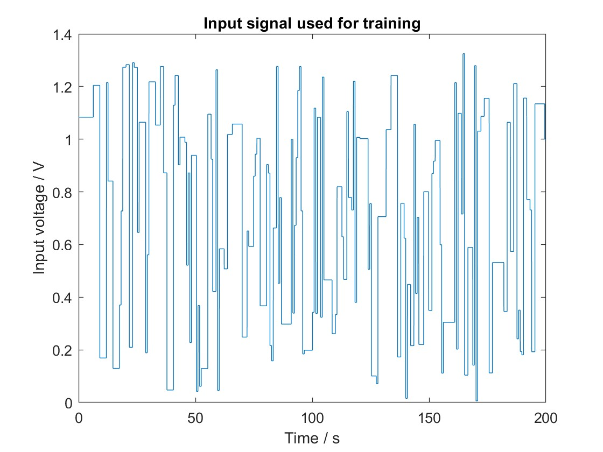
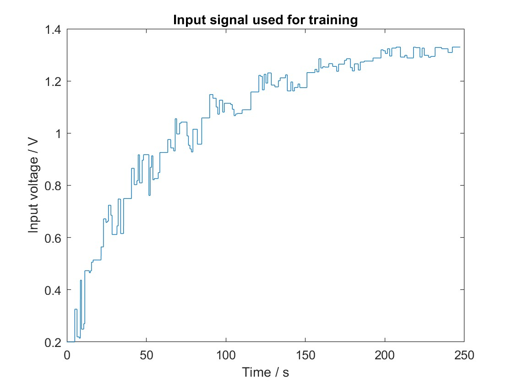

# HelicraneControl-ANN-TakagiSugeno-PFC

## Project Overview
This repository hosts a comprehensive analysis and implementation of control models for a helicrane device using advanced modeling and control strategies. It includes two distinct modeling approaches: an Artificial Neural Network (ANN) and a Takagi-Sugeno model utilizing multiple Local Linear Models (LLMs) calculated using Least Squares Estimation (LSE) combined with the set of fuzzy rules, obtained using the Gustafson-Kessel fuzzy clustering. The project further explores the application of a Predictive Functional Controller (PFC) based on the Takagi-Sugeno model. 

## Objectives
- Develop and compare two modeling approaches (ANN and Takagi-Sugeno with LLM) for helicrane dynamics. 
- Implement a PFC controller based on the Takagi-Sugeno model.
- Analyze the effectiveness of each model and the controller in managing helicrane dynamics.

## Methodology
- Description and implementation of the ANN model for helicrane dynamics. Bellow we show the results of ANN model on the training signals.
  
  

    
    
  

  
The results of ANN model on the testing signals:

 
 
- Development of the Takagi-Sugeno model, incorporating multiple Local Linear Models (LLMs) obtained through weighted Least Squares Estimation (LSE) and Gustafson-Kessel fuzzy clustering. Below, we present the membership functions derived from the Gustafson-Kessel fuzzy clustering process, along with the corresponding rule structure. We also show the input signal for identification and the models output for the training and testing signals.
  
  

    
    
    
    
    
  

- Detailed design and implementation of the PFC controller. Bellow, we show the results to the stepped reference.
  

    
    
  

## File Description
-  [HelicraneControl-ANN-TakagiSugeno-PFC Methodology (PDF)](HelicraneControlAnalysis.pdf): This document provides an in-depth theoretical background, the methodology employed, and a detailed analysis of the comparative performance of the models and the controller.

## Technologies and Techniques
- Artificial Neural Networks (ANN)
- Takagi-Sugeno Modeling with Local Linear Models (LLM)
- Least Squares Estimation (LSE)
- Gustafson-Kessel Fuzzy Clustering
- Predictive Functional Control (PFC)
